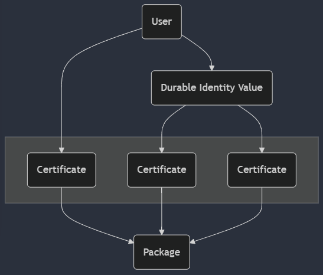
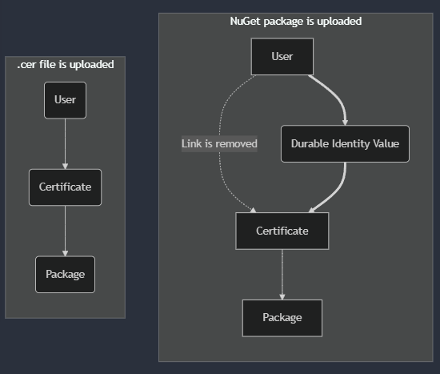
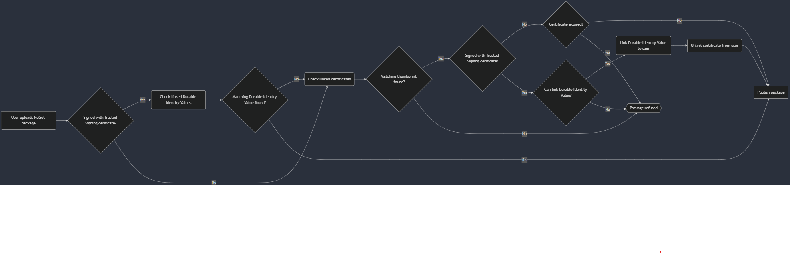
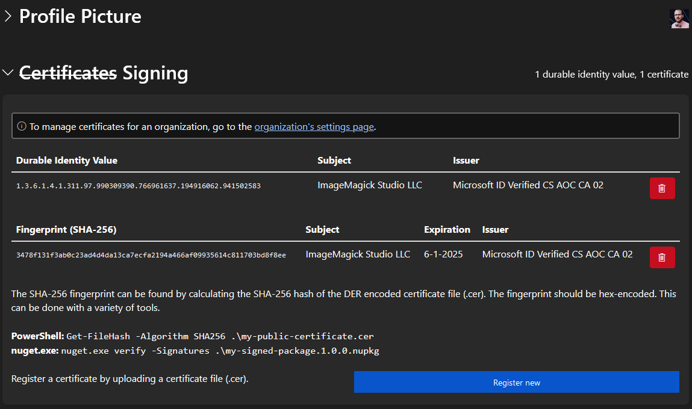

# Improve support for NuGet packages that are signed with a Trusted Signing certificate

- Author Name: Dirk Lemstra [dlemstra](https://github.com/dlemstra)
- GitHub Issue: https://github.com/NuGet/NuGetGallery/issues/10027

## Summary

This proposal is about improving the support for NuGet packages that are signed with a Trusted Signing certificate. This proposal
consists of three steps to improve the experience for users that sign their packages with Trusted Signing. These three steps can
be released separately but I can also understand that the NuGet team would want to launch this as a complete feature.

## Motivation

Earlier this year [Trusted Signing](https://learn.microsoft.com/en-us/azure/trusted-signing/) was launched by Microsoft and 
recently support for this was added to [Sign CLI](https://github.com/dotnet/sign). Packages signed with this can be uploaded
to the NuGet Gallery. But because the certificate is only valid for a short time a user will probably always need to update their
certificate on their account page. I would like to propose a set of changes to improve the experience for users that sign their
NuGet package with Trusted Signing.

## Explanation

### Functional explanation

### Step 1: Register EKU of certificate that was added by Trusted Signing

#### How would this be implemented?

The first step would be to store the EKU that is inside the certificate that was used to sign the NuGet package with Trusted
Signing. The certificate of Trusted Signing is currently only valid for three days, but it contains an EKU to that can be used
to get the identity of the owner of the certificate. There are two EKU's in the certificate. One that tells us that it was signed
with Trusted Signing (`1.3.6.1.4.1.311.97.1.0`) and another one that contains the Durable Identity Value (e.g.
`1.3.6.1.4.1.311.97.990309390.766961637.194916062.941502583`). More details about this can be found here:
https://learn.microsoft.com/en-us/azure/trusted-signing/concept-trusted-signing-cert-management.

I would like to propose to link Durable Identity Values to the user in a similar way as that is now done with certificates:



But this would require a user to enter that Durable Identity Value in the interface to link it with their account. We could also start with
automatically linking the Durable Identity Value to the user by using the current "certificate upload" interface. The user would need to do
the following:
- Extract the `.cer` file of the signing certificate from the NuGet package.
- Upload the `.cer` file and link it to their account.
- Upload the NuGet package that was signed with Trusted Signing.

Below is a picture that show how the certificate and Durable Identity Value would be linked to user before and after the NuGet package is
uploaded.



This would mean that the certificate is no longer linked to the user and will no longer be shown in the interface because the
Durable Identity Value is now linked to the user. That will mean that the user would need to contact the NuGet team to remove
the Durable Identity Value link until updates to the interface have been made. But I don't think a lot of people will need this
functionality right away.

The Durable Identity Value will only be linked when the following conditions are true:
- The package was signed within the last 30 days.
- The signing certificate must be issued by the root CA certificate `Microsoft Identity Verification Root Certificate Authority 2020`.
  (https://learn.microsoft.com/en-us/azure/trusted-signing/concept-trusted-signing-trust-models)
- The signing certificate contains the Trusted Signing EKU.
- The signing certificate contains an EKU with the Durable Identity Value.
- The Durable Identity Valueis not already linked to the user.

This mean that the following would happen inside the service that handles the upload of NuGet packages:



As shown in the image there are is no check if the certificate is expired when the user uploaded a Trusted Signing certificate.
This now happens when the user uploads a certificate but this check should not be added to Trusted Signing certificates because
they will expire after three days.

#### How does this help the user?

This helps the user because they will now no longer need to upload a `.cer` file everytime they publish a new NuGet package that
was signed with the same Trusted Signing certificate. But inside the NuGet Gallery they will no longer see the certificate that
they uploaded earlier. This could confuse the user so we could keep the link and let the user remove it manually. But doing this
would also not make it clear that an Durable Identity Value was linked to their account. Making this visible in the interface will
be the next step of these changes.

### Step 2: Change how Trusted Signing Durable Identity Values are shown in the NuGet Gallery.

#### How would this be implemented?

The next steps would be to change how this will be displayed inside the NuGet Gallery. Below is an image of how this could be
added to the account page of a user (please forgive me for my css skills). The naming is a proposal and I am open to suggestions
but I think it would be best to show the Durable Identity Value in a separate table.



This image demonstrates how this would look when a user has both a Durable Identity Value and certificate linked to their account.
As mentioned in step 1 the certificate would no longer be shown and the user would only see their Durable Identity Values. The 
Subject and Issuer will be extracted from the certificate the first time and added to the data of the Durable Identity Value.
Future uploads should also check the Subject and Issuer and update
the data if they have changed.

#### How does this help the user?

When only step 1 is implemented it will already be a huge help for users that use Trusted Signing but it will look strange inside
the NuGet Gallery because no certificates are shown anymore and they cannot unlink their Durable Identity Value. Adding this 
separate table with Durable Identity Values linked to the user their account would allow them to remove this Durable Identity Value.
I personally don't think users would really need this functionality right away so that is why I think this could be added as a second step.

### Step 3: Allow a user to submit a Public Trust identity Durable Identity Value in the NuGet Gallery

#### How would this be implemented?

When a `.cer` file is uploaded only the thumbprint is stored because the certificate is not parsed by the NuGet Gallery due to
security reasons. This means we cannot add the Durable Identity Value record when a certificate is uploaded. For a user that
has access to the Azure Portal it would be easier to copy the Durable Identity Value from the interface of the Azure Portal:


And this can also be done before a NuGet package has been signed. This copied value should then be entered into a form that adds
this Durable Identity Value to the user. As mentioned earlier the Subject and Issuer will be set once the first package that has
this Durable Identity Value is uploaded.

#### How does this help the user?

Adding this in the interface would make it possible for a user to register a Durable Identity Value in their account. This would
be easier than extracting the certificate from a signed NuGet package. The process to get that `.cer` file from a signed package
is not that simple. This would be the final step that would give a user full control over their Durable Identity Values.

### Technical explanation

<!-- Explain the proposal in sufficient detail with implementation details, interaction models, and clarification of corner cases. -->

## Drawbacks

<!-- Why should we not do this? -->

## Rationale and alternatives

<!-- Why is this the best design compared to other designs? -->
<!-- What other designs have been considered and why weren't they chosen? -->
<!-- What is the impact of not doing this? -->

## Prior Art

<!-- What prior art, both good and bad are related to this proposal? -->
<!-- Do other features exist in other ecosystems and what experience have their community had? -->
<!-- What lessons from other communities can we learn from? -->
<!-- Are there any resources that are relevant to this proposal? -->

## Unresolved Questions

<!-- What parts of the proposal do you expect to resolve before this gets accepted? -->
<!-- What parts of the proposal need to be resolved before the proposal is stabilized? -->
<!-- What related issues would you consider out of scope for this proposal but can be addressed in the future? -->

## Future Possibilities

Users of the NuGet client can now [trust a signing certificate](https://learn.microsoft.com/en-us/nuget/reference/cli-reference/cli-ref-trusted-signers)
but that now requires a thumbprint so support for the Durable Identity Value should also be added there. It is an existing issue
for users that want to trust a signing certificate that was issued by Trusted Signing. But this is something that can be added
at a later point in time.

And in the future it might also be a good idea to show the Durable Identity Value of the certificate that was used to signed in
the package overview instead of the thumbprint but I think this can also be added at a future point in time.

## Resources

<details>
<summary>Mermaid graphs</summary>

```
graph TD
    User(User)
    Cert1(Certificate)
    Cert2(Certificate)
    Cert3(Certificate)
    DurableIdentityValue(Durable Identity Value)
    Package(Package)

    subgraph Certificates[" "]
        Cert1
        Cert2
        Cert3
    end

    User --> Cert1
    User --> DurableIdentityValue
    DurableIdentityValue --> Cert2
    DurableIdentityValue --> Cert3
    Cert1 --> Package
    Cert2 --> Package
    Cert3 --> Package
```

```
graph TD
    subgraph after["NuGet package is uploaded"]
        User -. Link is removed .-> Certificate
        Certificate --> Package
        User ==> DurableIdentityValue(Durable Identity Value)
        DurableIdentityValue ==> Certificate
    end

    subgraph before[".cer file is uploaded"]
        UserB(User) --> CertificateB(Certificate)
        CertificateB --> PackageB(Package)
    end
```

```
graph LR
    Upload(User uploads NuGet package) --> TS{Signed with Trusted Signing cerificate?}
    TS -- Yes --> CheckDurableIdentityValue(Check linked Durable Identity Values)
    CheckDurableIdentityValue --> MatchDurableIdentityValue{Matching Durable Identity Value found?}
    MatchDurableIdentityValue -- No --> CheckCert
    TS -- No --> CheckCert(Check linked certificates)
    MatchDurableIdentityValue -- Yes --> PublishPackage(Publish package)
    CheckCert --> MatchCert{Matching thumbprint found?}
    MatchCert -- Yes --> WasDurableIdentityValue{Signed with Trusted Signing cerificate?}
    MatchCert -- No --> Refuse{{Package refused}}
    WasDurableIdentityValue -- No --> CheckExpired{Certificate expired?}
    CheckExpired -- No --> PublishPackage
    CheckExpired -- Yes --> Refuse
    WasDurableIdentityValue -- Yes --> CanLinkDurableIdentityValue{Can link Durable Identity Value?}
    CanLinkDurableIdentityValue-- Yes --> LinkDurableIdentityValue(Link Durable Identity Value to user)
    CanLinkDurableIdentityValue -- No --> Refuse
    LinkDurableIdentityValue --> RemoveCert(Unlink certificate from user)
    RemoveCert --> PublishPackage
```
</details>
